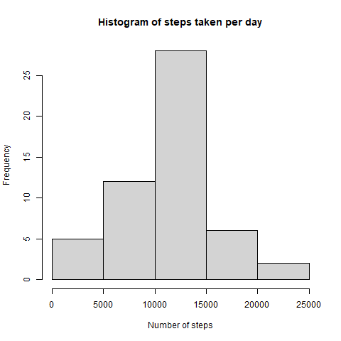
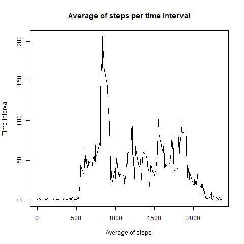
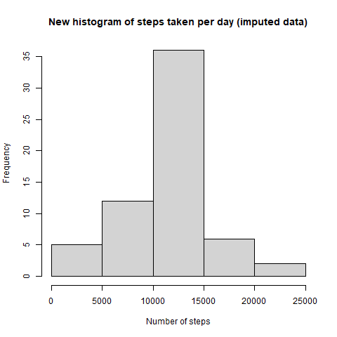
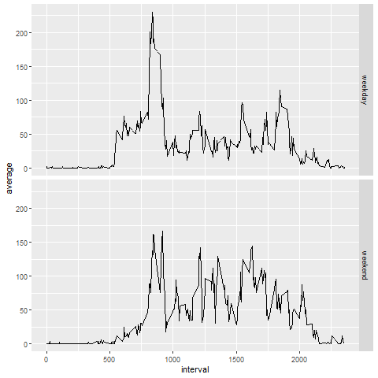

## Introduction

This assignment makes use of data from a device that collects a person's movement 
data at 5 minute intervals. The variables included in this data set are:

- **steps:** Number of steps taken in a 5 minute interval
- **date:** Date of the measurement taken
- **interval:** 5 minute interval in which measurement was taken

## Loading and preprocessing the data

We load the contents of the CSV file with 17,568 observations of steps, date and
interval into a data frame.


```r
data_activity <- read.csv("./activity.csv", header=TRUE)
```

## What is the mean and total number of steps taken per day?

We now calculate the total number of steps taken per day with the help of the 
plyr package and the ddply function. Missing values are ignored. 


```r
library(plyr)
```

```
## Warning: package 'plyr' was built under R version 4.0.5
```

```r
total_daily_steps <- ddply(data_activity, .(date), summarize, count=sum(steps))
```

Using the data set with the daily totals we make a histogram of the total number
of steps taken each day.


```r
hist(total_daily_steps$count, xlab="Number of steps", main="Histogram of steps taken per day")
dev.copy(png, file="./figure/plot1.png")
dev.off()
```


Also, we calculate the mean (10766) and median (10765) of steps taken per day.


```r
summary(total_daily_steps$count)
```

```
##    Min. 1st Qu.  Median    Mean 3rd Qu.    Max.    NA's 
##      41    8841   10765   10766   13294   21194       8
```

## What is the average daily activity pattern?

We now average the number of steps taken each time interval across all dates. 


```r
library(plyr)
minute_interval_steps <- ddply(data_activity, .(interval), summarize, average=mean(steps, na.rm = TRUE))
```

The time series plot of the average of steps across all dates is the following:


```r
plot(minute_interval_steps$interval, minute_interval_steps$average, type = "l", 
     main="Average of steps per time interval", xlab="Average of steps", ylab="Time interval")
dev.copy(png, file="./figure/plot2.png")
dev.off()
```


We see a peak in the morning, which occurs at 8:35 am.


```r
minute_interval_steps[which.max(minute_interval_steps$average),]
```

```
##     interval  average
## 104      835 206.1698
```

## Imputing missing values

We now calculate the total of missing values in the data set.


```r
sum(is.na(data_activity$steps))
```

```
## [1] 2304
```

We propose to fill out every 5 minute interval that is missing with the average 
of that 5 minute interval across all the other dates.


```r
# Make a copy of the original data set
data_activity_fill <- data_activity

# If we find a row with missing data, we fill it out with the average of that
# 5 minute interval.
for(i in 1:length(data_activity_fill$steps)) {
  if(is.na(data_activity_fill$steps[i])) {
    data_activity_fill$steps[i] <- round(minute_interval_steps$average[which(
      minute_interval_steps$interval == data_activity_fill$interval[i])])
  }
}

# Average of steps with the imputed data set
imputed_daily_steps <- ddply(data_activity_fill, .(date), summarize, count=sum(steps))
```

The histogram of the total number of steps taken each day with this new imputed 
data set looks like this.

```r
hist(imputed_daily_steps$count, xlab="Number of steps", 
     main="New histogram of steps taken per day (imputed data)")
dev.copy(png, file="./figure/plot3.png")
dev.off()
```


Compared to the original data set, the mean is the same (10766) but the median is 
a little lower (10762 now vs 10765 in the previous data set). 

```r
summary(imputed_daily_steps$count)
```

```
##    Min. 1st Qu.  Median    Mean 3rd Qu.    Max. 
##      41    9819   10762   10766   12811   21194
```

The fact that the median has slightly decreased indicates that the missing values 
that were imputed are lower than the average. However, this variation of the median
is only around 0.03%.

## Are there differences in activity patterns between weekdays and weekends?

We now create a factor variable in the original data set with two levers: "weekday"
and "weekend". This example was generated with a spanish locale and checks if the
last letter is an "o". In english, the equivalent would be to check if the weekday
starts with an s ("^[s]").


```r
data_activity_fill <- mutate(data_activity_fill, daytype = factor(1*(grepl("[o]$", 
        weekdays(as.Date(data_activity_fill$date)))), labels = c("weekday","weekend")))
```

We calculate again the average for each time interval, this time using the two 
levels we generated in the previous step, so there will be two values for 0, 5, 10
up to 2355. 


```r
library(plyr)
minute_interval_steps_fill <- ddply(data_activity_fill, .(interval,daytype), summarize, average=mean(steps))
```

Finally, we make a panel plot to compare the average of steps for each time interval 
between weekdays and weekend days.


```r
library(ggplot2)
qplot(interval, average, data=minute_interval_steps_fill, facets=daytype~., geom="line")
dev.copy(png, file="./figure/plot4.png")
dev.off()
```

